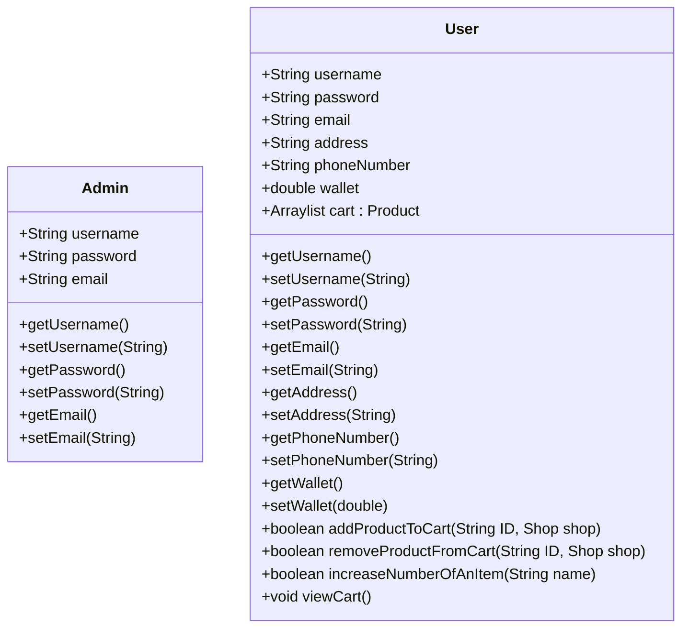
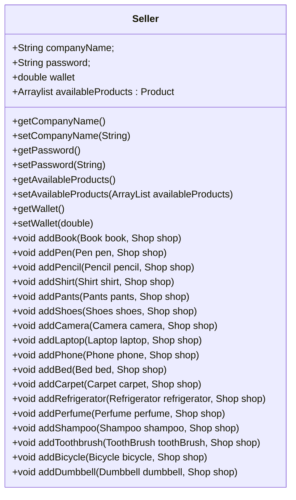
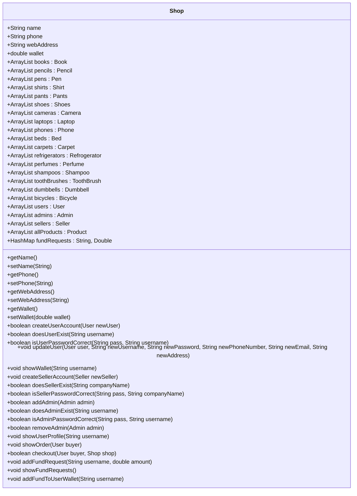

# Digikala/Amazon Project
 This project is a simple shopping program. You can use it as an admin, a user or a seller. It includes different classes for different product categories, such as electronics, sport, etc. Each category has also got some different groups with different attributes. (I wanted to add more categories and attributes, but unfortunately I ran out of time :) )

### Product class
We have a class named Product which all the categories are inherited from it. Each product has a name, price, category, seller and a unique ID that is a 10-digit number, because it is easier to work with IDs than products' names.

A product can be in more than one seller's product list.

```mermaid
classDiagram
class product{
        +String name
        +double price
        +int quantity
        +String category
        +Seller seller
        +String ID
        +getName()
        +setName(String name)
        +getPrice()
        +setPrice(double price)
        +getQuantity()
        +setQuantity(int quantity)
        +getCategory()
        +setCategory(String category)
        +getSeller()
        +setSeller(Seller seller)
        +getID()
        +setID(String ID) 
    }
    product <|-- Cloths
    product <|-- Electronics
    product <|-- Home AndKitchen
    product <|-- PersonalCare
    product <|-- Sport
    product <|-- Book
    product <|-- Pen
    product <|-- Pencil
    
    class Book {
        +String author
        +int yearOfPublish
        +getAuthor()
        +setAuthor(String author) 
        +getYearOfPublish() 
        +setYearOfPublish(int yearOfPublish)
    }
    class Pen{
        +String color
        +String brand
        + getColor()
        +setColor(String color) 
        +getBrand()
        +setBrand(String brand) 
    }
    class Pencil{
        +String color
        +String brand
        + getColor()
        +setColor(String color) 
        +getBrand()
        +setBrand(String brand) 
    }
    class Cloths{
        +String color
        +String size
        +String material
        +getColor()
        +setColor(String color)
        +getSize()
        +getMaterial()
    }
    class Electronics{
        +String color;
        +String brand
        +double weight
        +getColor()
        +setColor(String color)
        +getBrand()
        +setBrand(String brand)
        +getWeight()
        +setWeight(double weight)
    }
    class HomeAndKitchen {
        +String brand
        +String color
        +String getBrand()
        +setBrand(String brand)
        + String getColor() 
        +setColor(String color)
      
    }
    class PersonalCare{
        +String brand
        +String ageRange
        +getBrand() 
        +setBrand(String brand)
        +getAgeRange()
        +setAgeRange(String ageRange)
    }
    class Sport{
        +double weight
        +String color
        +getWeight()
        +setWeight(double weight) 
        +getColor()
        +setColor(String color) 
       
    }
    Cloths <|-- Shirt
    Cloths <|-- Pants
    Cloths <|-- Shoes
    Electronics <|-- Laptop
    Electronics <|-- Phone
    Electronics <|-- Camera
    HomeAndKitchen <|-- Carpet
    HomeAndKitchen <|-- Bed
    HomeAndKitchen <|-- Refrigerator
    PersonalCare <|-- Shampoo
    PersonalCare <|-- Perfume
    PersonalCare <|--ToothBrush
    Sport <|-- Dumbbell
    Sport <|-- Bicycle
    
    class Shirt{
         +String collarModel
         +String type
         +getCollarModel()
         +setCollarModel(String collarModel)
         +getType()
         +setType(String type)
    }
    class Pants{
        +int height
        +String type
        +getHeight()
        +setHeight(int height)
        +getType()
        +setType(String type)
    }
    class Shoes{
        +String brand
        +getBrand()
        +setBrand(String brand)
    }
    class Laptop{
        +String OS
        +int ram
        +int storage
        +String CPU
        +String getOS()
        +setOS(String OS)
        +getRam() 
        +setRam(int ram)
        +getStorage()
        +setStorage(int storage)
        +getCPU() 
        +setCPU(String CPU) 
    }
    class Phone{
        +String OS
        +int ram
        +int storage
        +String cameraQuality
        +double screenSize
        +String getOS()
        +setOS(String OS)
        +getRam() 
        +setRam(int ram)
        +getStorage()
        +setStorage(int storage)
        +getCameraQuality()
        +setCameraQuality(String cameraQuality)
        +getScreenSize()
        +setScreenSize(double screenSize)
    }
    class Camera{
        +String opticalZoom
        +getOpticalZoom()
        +setOpticalZoom(String opticalZoom)
    }
    class Carpet{
        +String shape
        +double height
        +double width
        +getShape()
        +setShape(String shape)
        + getHeight()
        +setHeight(double height)
        +getWidth()
        +setWidth(double width)
    }
    class Bed{
        +String size
        +String material
        +getSize()
        +setSize(String size)
        +getMaterial()
        +setMaterial(String material)
    }
    class Refrigerator{
        +String modelName
        +double height
        + getModelName()
        +setModelName(String modelName)
        +getHeight()
        +setHeight(double height)
    }
    class Shampoo{
        +double volume
        +String hairType
        + getVolume()
        +setVolume(double volume)
        +getHairType()
        +setHairType(String hairType)
    }
    class Perfume{
        +double volume
        +String scent
        +getVolume()
        +setVolume(double volume)
        +getScent()
        +setScent(String scent) 
    }
    class ToothBrush{
        +String color
        +getColor()
        +setColor(String color)
    }
    class Dumbbell{
        +String shape
        +getShape()
        +setShape(String shape)
    }
    class Bicycle{
        +String ageRange
        +String material
        +getAgeRange()
        +setAgeRange(String ageRange)
        +getMaterial()
        +setMaterial(String material)
    }
    
```

There is also a category named books and art which has products like book, pen and pencil.
But I couldn't find any attributes that are same in these products to put in a BooksAndArt class. So, these products are directly inherited from Product class.

## Admin and User diagrams
Each user has a cart which is an arraylist of products.Some of cart-related methods -such as adding or removing products- are in user class :

## Seller diagram
This class has a list of products for each seller.When a seller adds a new product, it will be added to three lists : this list, a list of all products, and the list of its own category(For example a book will be added to the list of all books).The second and third lists are in Shop class.

  At first, I had just one method called addProduct for adding a new product. But it just could add the new product to the seller's list and the allProducts list and I couldn't have a list for each category.
So I decided to use different methods for adding different product types.(It may not be that efficient, but nothing better has crossed my mind yet)

## Shop
I've handled the majority of functions that are used in main class, here.

For example :
* Methods for creating new accounts(as an admin, a user or a seller)
* Method to update user's information
* Methods for showing the order and checking out
* Method to make fund request 
* Method to add fund to users' wallet

This class also has :

* A list of all admins, all users and all sellers
* A list of all products
* A list for each product category
* A map of the users that have requested for fund

## Main class
After running the program, current date, shop's name, phone number and web address will be displayed.
Then it asks if you want ot log in or sign up. 

You can log in as an admin, a user or a seller.Each of these account types has got its own menu. For example if you log in as an admin, the adminMenu will be called, and you can choose what you want to do among the options.

You can sign up as a user or seller(New admins can only be added by admins).
For signing up, you need to give required information and then your account will be added.

### User menu

Users can view available products, make fund request, add products to their cart, view their cart and wallet, and edit their profile.

In viewing products section, they should choose a category and then the list of all available products of that type will be displayed(With their details).

For making a fund request, username and the amount of fund is needed.

If you want to add a product to your cart, you should enter its ID.If the ID is correct and the product is available, it will be added to your cart . Otherwise, it won't.

In view cart section, you can see the products you have added to your cart. And you can remove them, increase their number or checkout.
In checking out process, your order will be displayed at first. Each order has a date and time, list of products and a total price.
After submitting the order, the total price will be removed from the user's wallet. 90 percent of each product's price will be added to its seller's wallet. The remaining 10 percent is the shop's cut.

### Admin menu
An admin can add new admins, view a user's profile and check new fund requests.Admins can see which user has made fund request.The amount of fund the user needs will be showed to admin, too.And admin can accept the request or not.

### Seller menu
Sellers can see their wallet and add a new product to their list by providing the required information.For each product category, some specific information is needed.For example, if you want to add a new book, its name, ID, price, author, quantity and year of publish is needed. 

